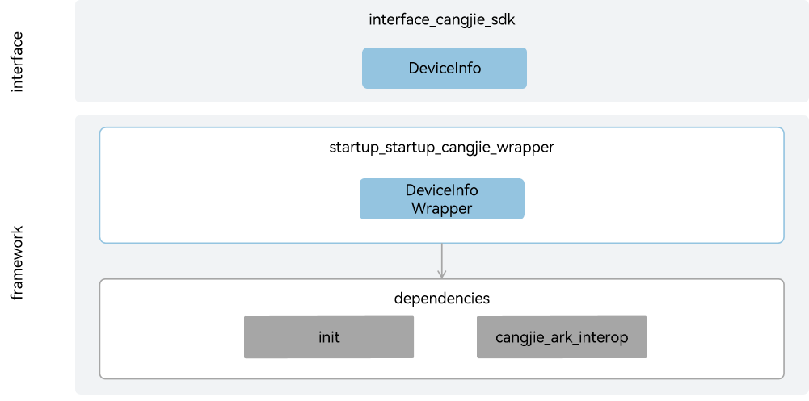

# startup_startup_cangjie_wrapper(beta feature)

## Introduction

The startup_startup_cangjie_wrapper provides device information query services for developers using the Cangjie language for application development on OpenHarmony. The currently open startup_startup_cangjie_wrapper only supports standard devices.

## System Architecture

**Figure 1** startup_cangjie_wrapper architecture



As shown in the architecture diagram, the current startup_startup_cangjie_wrapper provides device information services:

Interface Layer：
- DeviceInfo: Provides device information query capabilities for developers. Device information mainly includes device type information, device manufacturer information, system software API version information, and device UDID information.

Framework Layer：
- DeviceInfo Wrapper: Implements device information query capabilities based on the device information SA service provided by the underlying init component.

Dependency Components Introduction in Architecture:
- init: DeviceInfo Wrapper depends on the device information SA service provided by the init component for framework layer capability implementation.
- cangjie_ark_interop: DeviceInfo Wrapper depends on APILevel class definitions and BusinessException class definitions for API annotation and throwing exceptions to users in error branches.

## Directory Structure

```
base/startup/startup_cangjie_wrapper
├── figures         # architecture pictures
└── ohos            # Cangjie startup subsystem interface implementation
│   └── device_info # DeviceInfo module implementation
└── test            # Cangjie startup subsystem test cases
    └── device_info # DeviceInfo test cases
```

## Usage

The current startup_startup_cangjie_wrapper mainly provides device information services.

- DeviceInfo.

For startup related APIs, please refer to [ohos.device_info (Device Information)](https://gitcode.com/openharmony-sig/arkcompiler_cangjie_ark_interop/blob/master/doc/API_Reference/source_en/apis/BasicServicesKit/cj-apis-device_info.md).

## Constraints

To obtain device serial number information or udid information, the ohos.permission.sec.ACCESS_UDID permission is required (this permission can only be requested by system applications and enterprise customized applications).

## Code Contribution

Developers are welcome to contribute code, documentation, etc. For specific contribution processes and methods, please refer to [Code Contribution](https://gitcode.com/openharmony/docs/blob/master/en/contribute/code-contribution.md).

## Repositories Involved

[arkcompiler_cangjie_ark_interop](https://gitcode.com/openharmony-sig/arkcompiler_cangjie_ark_interop)

[startup_init](https://gitcode.com/openharmony/startup_init)