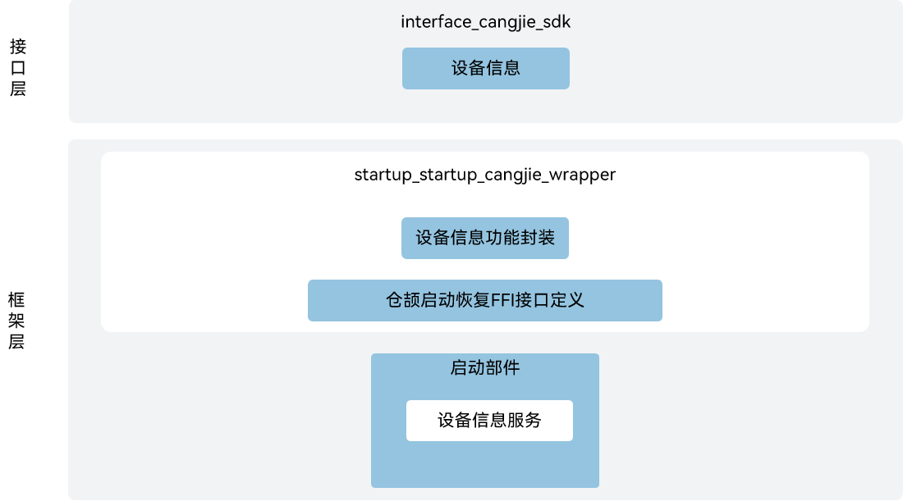

# 启动恢复仓颉接口

## 简介

启动恢复仓颉接口是在OpenHarmony上基于启动恢复子系统能力之上封装的仓颉API。启动恢复主要负责在内核启动之后到应用启动之前系统关键进程和服务的启动过程。当前开放的启动恢复仓颉接口仅支持standard设备。

## 系统架构

**图 1** 启动恢复仓颉架构图



如架构图所示，当前启动恢复仓颉接口提供设备信息服务:

- 设备信息: 主要包括OHOS固定值参数、厂商固定值参数以及厂商动态参数。
- 仓颉启动恢复FFI接口定义： 负责定义C语言互操作仓颉接口，用于实现仓颉启动恢复能力。
- 启动引导部件：负责提供设备信息SA服务，封装C语言接口提供给仓颉进行互操作。
- 仓颉互操作：提供API标签与异常类。

## 目录

```
base/startup/startup_cangjie_wrapper
├── figures         # 存放README中的架构图
└── ohos            # 仓颉启动恢复子系统接口实现
│   └── device_info # 设备信息模块实现
└── test            # 仓颉启动恢复子系统测试用例
```

## 使用说明

当前启动恢复仓颉接口主要设备信息服务。

启动恢复相关API请参见[ohos.device_info（设备信息）](https://gitcode.com/openharmony-sig/arkcompiler_cangjie_ark_interop/blob/master/doc/API_Reference/source_zh_cn/apis/BasicServicesKit/cj-apis-device_info.md)。

## 参与贡献

欢迎广大开发者贡献代码、文档等，具体的贡献流程和方式请参见[参与贡献](https://gitcode.com/openharmony/docs/blob/master/zh-cn/contribute/%E5%8F%82%E4%B8%8E%E8%B4%A1%E7%8C%AE.md)。

## 相关仓

[arkcompiler_cangjie_ark_interop](https://gitcode.com/openharmony-sig/arkcompiler_cangjie_ark_interop)
[startup_init](https://gitcode.com/openharmony/startup_init)
