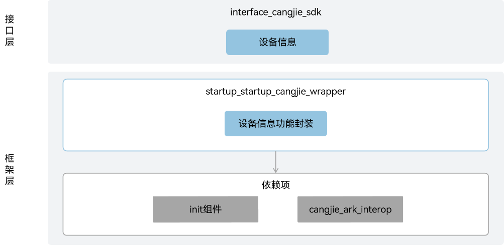

# 启动恢复仓颉封装

## 简介

启动恢复仓颉封装是在OpenHarmony上面向开发者使用仓颉语言进行应用开发时提供的设备信息查询服务。当前开放的启动恢复仓颉封装仅支持standard设备。

## 系统架构

**图 1** 启动恢复仓颉封装架构图



如架构图所示:

接口层：

- 设备信息：面向开发者提供设备信息查询能力，设备信息主要包括设备类型信息、设备生产厂家信息、系统软件API版本信息以及设备udid信息等。

框架层：

- 设备信息功能封装：基于底层init组件提供的设备信息SA服务，实现设备信息的查询能力。

架构图中依赖部件引入说明：
- init组件：依赖init组件提供设备信息SA服务，用于框架层能力的实现。
- cangjie_ark_interop：依赖cangjie_ark_interop提供的仓颉注解类定义和BusinessException异常类定义，用于对API进行标注，及在错误分支向用户抛出异常。


## 目录

```
base/startup/startup_cangjie_wrapper
├── figures         # 存放README中的架构图
└── ohos            # 仓颉启动恢复子系统接口实现
│   └── device_info # 设备信息模块实现
└── test            # 测试用例
    └── device_info # 设备信息测试用例
```

## 使用说明

当前启动恢复仓颉封装提供以下能力：

- 设备信息。

启动恢复相关接口请参见[设备信息API文档](https://gitcode.com/openharmony-sig/arkcompiler_cangjie_ark_interop/blob/master/doc/API_Reference/source_zh_cn/apis/BasicServicesKit/cj-apis-device_info.md)。

## 约束

获取设备序列号信息，需要ohos.permission.sec.ACCESS_UDID(该权限只允许系统应用及企业定制应用申请)。

## 参与贡献

欢迎广大开发者贡献代码、文档等，具体的贡献流程和方式请参见[参与贡献](https://gitcode.com/openharmony/docs/blob/master/zh-cn/contribute/%E5%8F%82%E4%B8%8E%E8%B4%A1%E7%8C%AE.md)。

## 相关仓

[arkcompiler_cangjie_ark_interop](https://gitcode.com/openharmony-sig/arkcompiler_cangjie_ark_interop)

[startup_init](https://gitcode.com/openharmony/startup_init)
